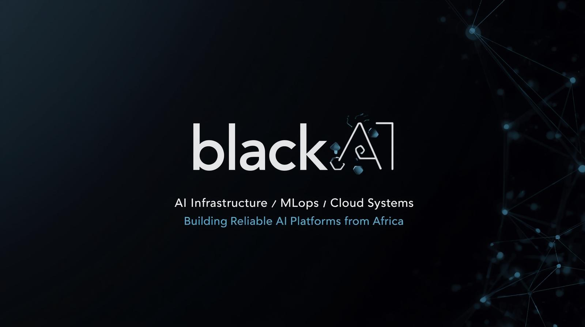

  

# 👋 Tiberius Asiago

## AI Infrastructure & MLOps Engineer  
Building reliable, scalable AI systems from Africa.

---

### 🚀 About Me

I design and deploy production-ready AI systems with a strong foundation in networking, cloud architecture, and Linux systems.

With a background in telecommunications and cloud infrastructure, I specialize in building resilient ML platforms — from containerized model serving to GPU training pipelines and Kubernetes-based deployments.

My focus is not just building models — but building the infrastructure that makes AI reliable, scalable, and observable.

---

### 🧰 Tech Stack

## 📊 GitHub Stats

### 🔧 Core Focus Areas

- Containerized ML APIs (FastAPI + Docker)
- GPU-based training environments (CUDA + PyTorch)
- ML experiment tracking (MLflow + DVC)
- Kubernetes for ML workloads
- CI/CD for ML systems
- Infrastructure as Code
- Observability (Prometheus, Grafana)

---

## 🔭 Currently Building

- 🚀 Production ML API (FastAPI + Docker + CI/CD)
- 🧪 GPU Experiment Tracking Lab (MLflow + DVC)
- ⚙️ Kubernetes ML Scaling Environment
- 📊 AI Observability Stack (Prometheus + Grafana)  

---

### 🧰 Tech Stack

**Infrastructure**
- Linux
- Docker
- Kubernetes
- Terraform
- GitHub Actions
- AWS

**Machine Learning**
- PyTorch
- MLflow
- DVC
- Scikit-learn

**Monitoring**
- Prometheus
- Grafana
- Loki

**Systems Background**
- Networking (VPC, VPN, SD-WAN)
- Cloud Architecture
- Firewall & Security Systems

---

### 📂 Featured Projects

- 🚀 ML API Production Deployment
- 🧪 GPU ML Experiment Lab
- ⚙️ Kubernetes ML Scaling
- 📊 AI Monitoring Stack
- 🏗 AI Infrastructure Capstone Platform

(Projects currently under active development.)

---

### 📝 Technical Blog

I document my AI Infrastructure journey here:

👉 [AI Infrastructure Notes](https://tiberius-asiago.github.io)

Topics include:
- Designing AI platforms for startups
- DevOps for ML
- Linux deep dives
- GPU experiments
- Infrastructure lessons from telecom

---

### 🌍 Vision

To design reliable AI platforms that empower startups across Africa and emerging markets.

---

### 📫 Connect With Me

LinkedIn: www.linkedin.com/in/tiberiusasiago  
Email: tibeasiago@gmail.com
